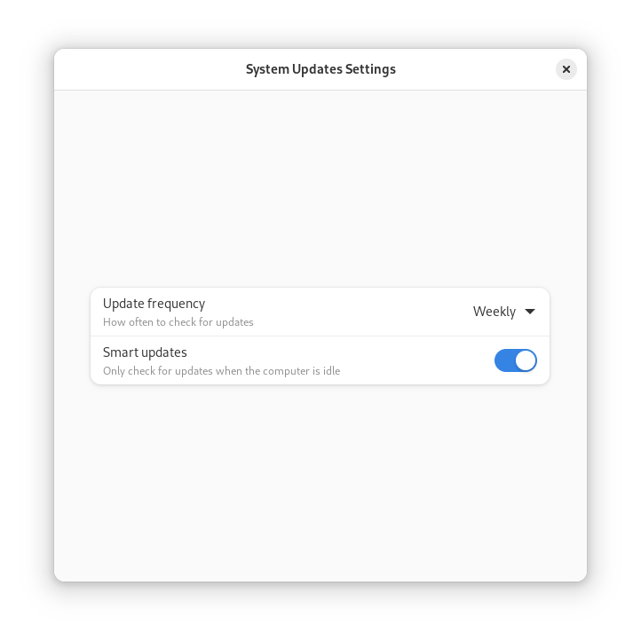

<div align="center">
    
    <h1>Vanilla Updates Utility</h1>


[![Translation Status][weblate-image]][weblate-url]

[weblate-url]: https://hosted.weblate.org/engage/vanilla-os/
[weblate-image]: https://hosted.weblate.org/widgets/vanilla-os/-/vanilla-updates-utility/svg-badge.svg

<p>A frontend in GTK 4 and Libadwaita to manage system updates in Vanilla OS.</p>
<br />

</div>

## Build

### Dependencies

- build-essential
- meson
- libadwaita-1-dev
- gettext
- desktop-file-utils
- vso

### Build

```bash
meson setup build
ninja -C build
```

### Install

```bash
sudo ninja -C build install
```

## Run

```bash
vanilla-updates-utility

# embedded mode
vanilla-updates-utility --embedded
```
